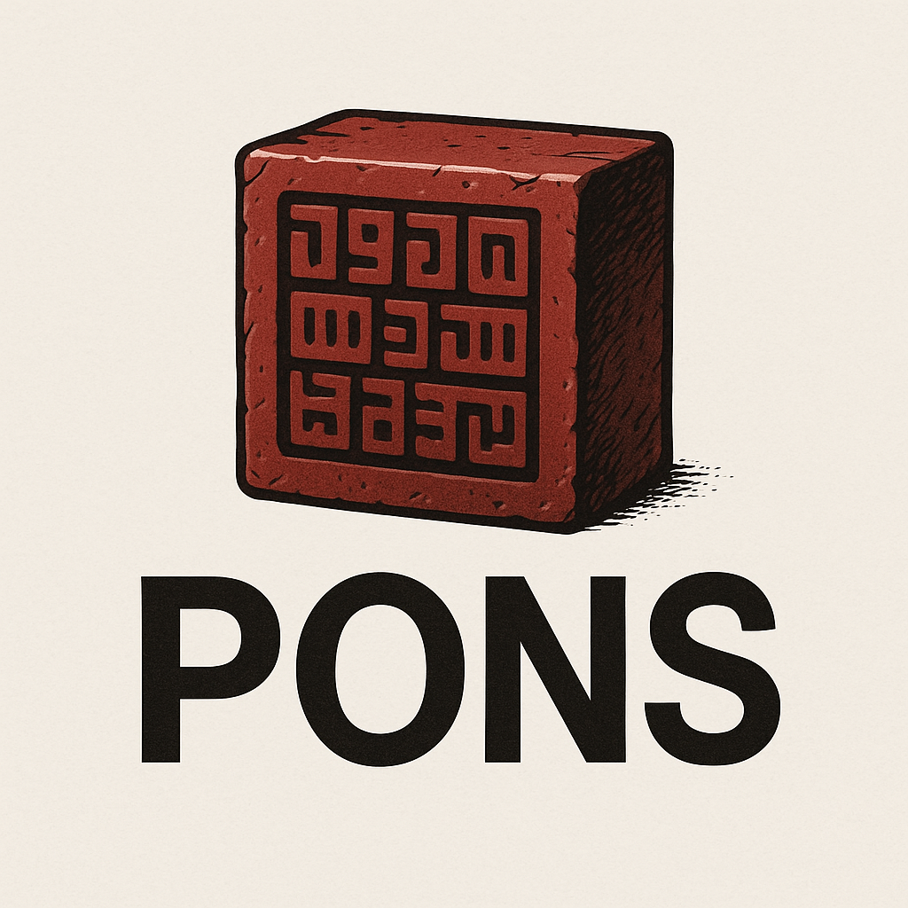

<div align="center">
  
  
  # PONS - Proof of Non-Spam for Bitcoin
  
  [](https://github.com/AbdelStark/pons/actions/workflows/ci.yml)
  [](https://github.com/AbdelStark/pons/actions/workflows/cairo-test.yml)
  [](https://github.com/AbdelStark/pons/actions/workflows/rust-test.yml)
  [](https://github.com/AbdelStark/pons/actions/workflows/e2e-test.yml)

  **A STARK-based system for proving that Bitcoin transactions contain legitimate cryptographic material rather than arbitrary spam data.**
</div>

## Problem

Bitcoin transactions increasingly contain arbitrary data disguised as legitimate script elements, particularly in Taproot outputs where spammers create fake Taproot trees. Current filtering approaches either allow spam through or break legitimate use cases like BitVM.

## ⚠️ Disclaimer

This project is a **proof-of-concept** and is **highly experimental**. It is published for research and educational purposes to demonstrate a potential application of STARKs for filtering transaction data on Bitcoin.

**DO NOT use this software in a production environment or with real Bitcoin transactions.**

Please be aware of the following limitations in the current implementation:

- **Illustrative use case only**: The current system only proves the validity of a single public key. This use case was chosen as a foundational example to demonstrate the end-to-end architecture. In a real-world scenario, verifying a public key this way is completely overkill, as it could be done without a validity proof. The overhead in terms of proof generation time and size is substantial and not practical for this simple task alone. A meaningful, real-world application would require extending the proof to cover the validity of an entire Taproot tree. This would involve proving that each leaf contains a valid Bitcoin Script instead of arbitrary data, which in turn would necessitate a significantly more complex Cairo program.

- **Computational integrity, not Zero-Knowledge**: The proofs generated by PONS are **STARKs**, not **ZK-STARKs**. They provide *computational integrity*—proving that the verification computation was executed correctly—but they **do not provide privacy**. The data being proven (e.g., the public key) is not hidden by the proof. The zero-knowledge aspect is outside the current scope of the project.

## Solution

PONS uses STARK proofs to cryptographically verify that transaction elements contain valid data structures (public keys, hashes, script elements). Transaction senders generate proofs demonstrating their outputs contain legitimate cryptographic material, and relays/miners only accept transactions with valid proofs.

## Architecture

```text
┌─────────────────┐    ┌─────────────────┐    ┌─────────────────┐
│   pons_cli      │    │  pons_stark     │    │  pons_relay     │
│   (Rust)        │────│  (Cairo)        │────│  (Rust)         │
│                 │    │                 │    │                 │
│ • Keypair gen   │    │ • Sig verify    │    │ • Proof verify  │
│ • Tx creation   │    │ • STARK proof   │    │ • Tx relay      │
│ • Proof orchestr│    │ • Cairo program │    │ • Network layer │
└─────────────────┘    └─────────────────┘    └─────────────────┘
         │                       │                       │
         │                       │                       │
         ▼                       ▼                       ▼
┌─────────────────────────────────────────────────────────────────┐
│                    Bitcoin Network                              │
│  • Standard P2TR outputs with verified cryptographic material   │
└─────────────────────────────────────────────────────────────────┘
```

- **pons_stark**: Cairo program that verifies Schnorr signatures and generates STARK proofs
- **pons_cli**: Rust CLI for keypair generation, signing, and proof orchestration
- **pons_relay**: Rust HTTP server that verifies STARK proofs and relays valid transactions

## Quick Start

### Prerequisites

- **Python 3.10** (required for Garaga)
- **Rust nightly-2025-01-02** (required for Stwo)
- **Scarb nightly** (Cairo toolchain)

### Installation

```bash
# Install dependencies
python3.10 -m pip install garaga

# Clone and build
git clone https://github.com/AbdelStark/pons.git
cd pons

# Build components
cd pons_stark && scarb build && cd ..
cd pons_cli && cargo build --release && cd ..

# Run end-to-end test
./test_e2e.sh
```

### Usage

```bash
# Interactive demo (recommended for first-time users)
./demo.sh

# Generate keypair
./pons_cli/target/release/pons-cli keygen --output keypair.json

# Sign message
./pons_cli/target/release/pons-cli sign --keypair keypair.json --message "Hello PONS!"

# Generate STARK proof (requires cairo-prove)
cairo-prove prove pons_stark/target/dev/pons_stark.executable.json proof.json --arguments-file args.json
```

## Development

### Testing

```bash
# Interactive demo with visual feedback
./demo.sh

# Automated end-to-end test
./test_e2e.sh

# Demo mode test (with pauses and enhanced visuals)
./test_e2e.sh --demo

# Individual component tests
cd pons_stark && scarb test    # Cairo tests
cd pons_cli && cargo test     # Rust tests
```

## License

MIT License - see [LICENSE](./LICENSE) file for details.

---

## About the Name

**PONS** stands for both **Proof Of Non-Spam** and **POneglyph Node Service** 🏴‍☠️

Like the indestructible Poneglyphs from One Piece that contain the true history of the world, PONS creates immutable cryptographic proofs that distinguish authentic Bitcoin transactions from the "fake history" of spam data. Just as only those with special knowledge can read the ancient scripts, only valid cryptographic material can generate the STARK proofs that PONS recognizes.

*The truth cannot be faked, only proven.*
